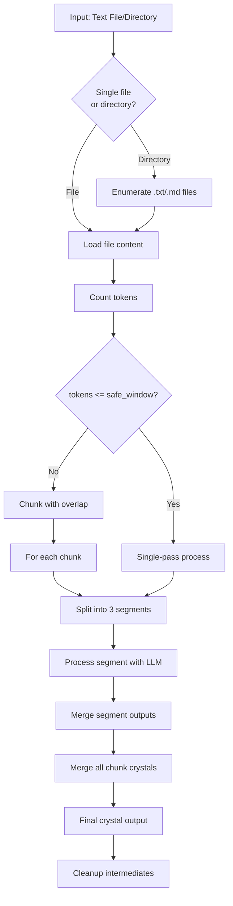
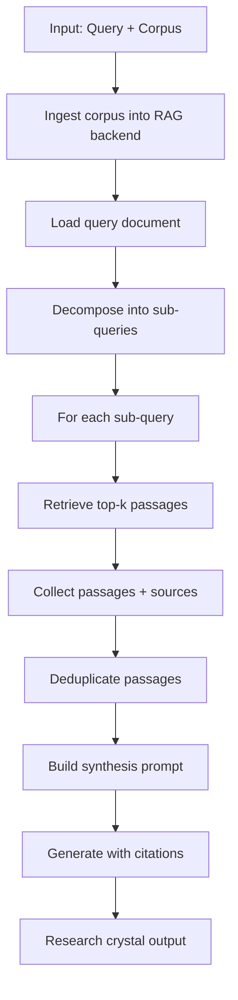
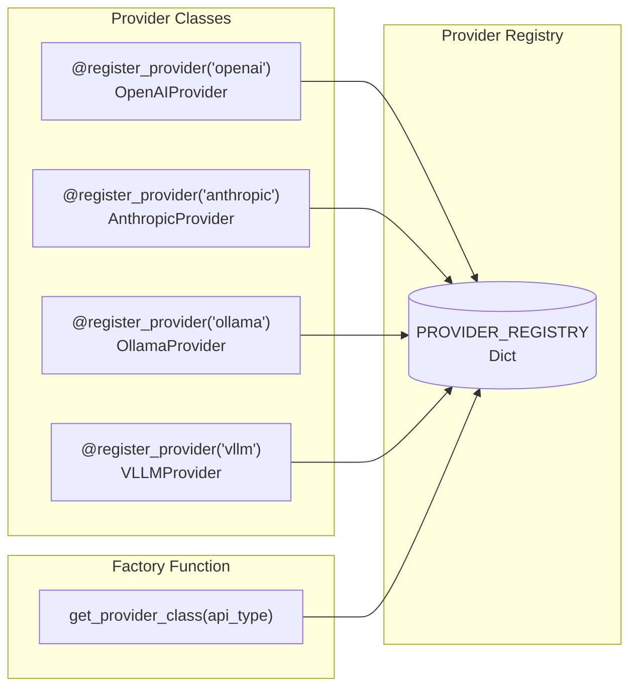
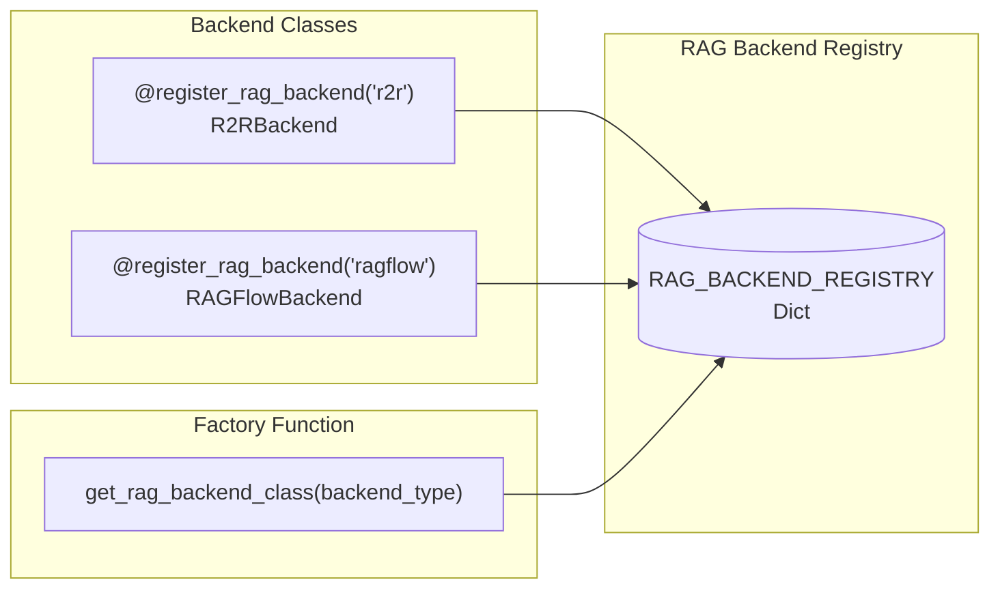
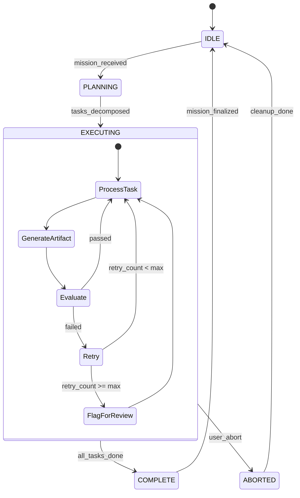
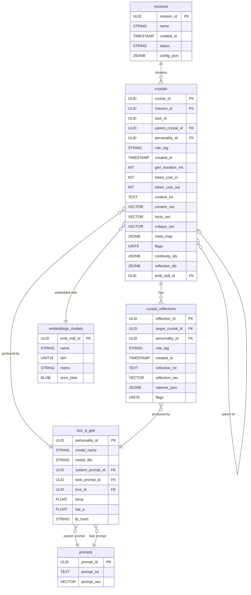
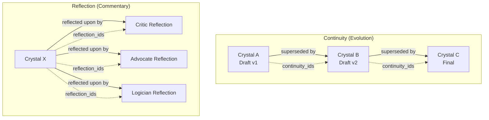
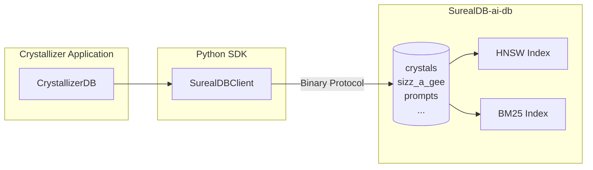
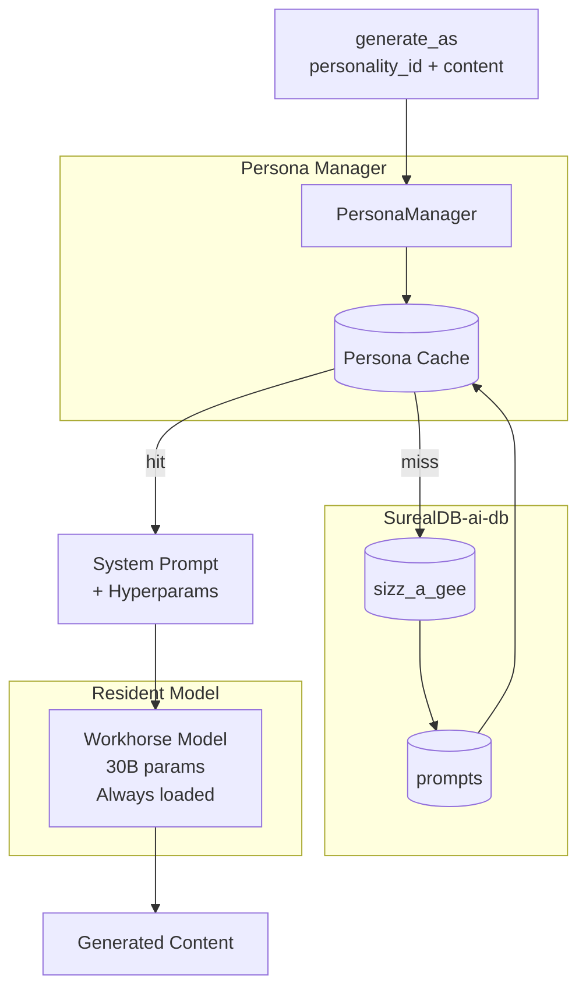

# Crystallizer Architecture

> This document describes the internal architecture of Crystallizer for contributors and integrators. For the project vision and roadmap, see [ROADMAP.md](./ROADMAP.md).

---

## Table of Contents

1. [Design Philosophy](#design-philosophy)
2. [System Overview](#system-overview)
3. [Processing Modes](#processing-modes)
4. [Provider Architecture](#provider-architecture)
5. [The Game Loop (v0.3+)](#the-game-loop-v03)
6. [Data Model](#data-model)
7. [SurealDB-ai-db Integration](#SurealDB-ai-db-integration)
8. [Persona System](#persona-system)
9. [Extension Points](#extension-points)

---

## Design Philosophy

### Metabolic Efficiency

Every computational expenditure should produce reusable artifacts. If we've already summarized Chapter 3, that summary should be:
- Stored (not discarded after the run)
- Indexed (searchable by text and semantic similarity)
- Attributed (we know which model/prompt produced it)
- Critiqueable (other agents can comment on it)

### No Framework Lock-in

We deliberately avoid LangGraph, LlamaIndex Workflows, and similar frameworks. Not because they're bad, but because:

1. **Crystallizer's workload is atypical**: Multi-day research sessions, massive corpora, local GPU clusters
2. **Framework abstractions leak**: When you need sub-millisecond vector queries, you can't afford an ORM
3. **Precision tuning matters**: Model-specific prompt engineering requires direct control

We build the minimal orchestration we need, nothing more.

### Cheap Synthesis

The expensive operation is LLM inference. The cheap operations are:
- Database queries (< 1ms with SurealDB)
- Text manipulation (microseconds)
- Embedding generation (50-100ms for a paragraph)

Architecture decisions favor **pre-indexed context retrieval** over **context stuffing**.

---

## System Overview

```mermaid
flowchart TB
    subgraph CLI["CLI / Entry Point"]
        main["crystallizer.py main()"]
    end
    
    subgraph Core["Crystallizer Core"]
        TC[Token Counter<br/>tiktoken]
        PL[Prompt Loader<br/>Jinja2]
        Router[Processing Mode Router<br/>NAIVE | RESEARCH]
    end
    
    subgraph Modes["Processing Modes"]
        subgraph Naive["Naive Mode"]
            WC[Window Chunking]
            SP[3-Segment Processing]
            HM[Hierarchical Merge]
        end
        
        subgraph Research["Research Mode"]
            RAG[RAG Backend]
            QD[Query Decomposition]
            PR[Passage Retrieval]
            CS[Citation Synthesis]
        end
    end
    
    subgraph Providers["Provider Layer"]
        OpenAI[OpenAI]
        Anthropic[Anthropic]
        Ollama[Ollama]
        vLLM[vLLM]
    end
    
    CLI --> Core
    Core --> Router
    Router --> Naive
    Router --> Research
    Naive --> Providers
    Research --> Providers
```

---

## Processing Modes

### Naive Mode (v0.1)

Linear document processing with token-aware windowing.



**Window calculation:**
```python
safe_window = max(2000, context_length - 2000)  # Reserve 2k for prompt + response
```

**Overlap strategy:**
```python
chunks = token_counter.chunk_text(content, max_tokens=safe_window, overlap=100)
```

### Research Mode (v0.2)

RAG-backed retrieval with citation synthesis.



**Query decomposition strategy:**
```python
def _decompose_query(self, query_content: str) -> List[str]:
    # Split by markdown headers (##, ###, etc.)
    # Fallback to entire query if no headers found
```

---

## Provider Architecture

### Registry Pattern

All LLM providers implement the same interface and register via decorator:



### Provider Interface

```python
class LLMProvider(Protocol):
    def __init__(self, connection_config: Dict[str, Any]): ...
    def generate(self, system_prompt: str, user_content: str) -> str: ...
```

### Implemented Providers

| Provider | API Type | Authentication | Notes |
|----------|----------|----------------|-------|
| `OpenAIProvider` | `openai` | Bearer token | Works with any OpenAI-compatible API |
| `AnthropicProvider` | `anthropic` | x-api-key header | Requires anthropic-version header |
| `OllamaProvider` | `ollama` | None | Local inference server |
| `VLLMProvider` | `vllm` | Optional bearer | OpenAI-compatible with vLLM extensions |

### Configuration Schema

```json
{
  "inference_service_connections": {
    "<connection-name>": {
      "api_type": "openai|anthropic|ollama|vllm",
      "base_url": "https://...",
      "api_key": "...",
      "default_model": "model-name",
      "default_ctx_len": 128000,
      "default_max_tokens": 1500,
      "default_temperature": 0.1,
      "timeout": 60,
      "options": { }
    }
  }
}
```

### RAG Backend Architecture (v0.2)

Mirrors the provider pattern:



**RAG Backend Interface:**
```python
class RAGBackend(Protocol):
    def ingest_corpus(self, corpus_path: str, corpus_name: str = None, **kwargs) -> str: ...
    def retrieve(self, query: str, corpus_id: str, top_k: int = 10, **kwargs) -> List[Passage]: ...
    def health_check(self) -> bool: ...
    def list_corpora(self) -> List[Dict[str, Any]]: ...
```

---

## The Game Loop (v0.3+)

### Conceptual Model

The "game loop" is a **behavioral metaphor**, not a performance contract. Unlike games (60fps, hard real-time), Crystallizer's loop is:

- **Persistent**: Doesn't exit between missions
- **Interruptible**: User can pause/abort at any point
- **Stateful**: All artifacts survive restarts
- **Self-aware**: Emits heartbeats for UI responsiveness



### Heartbeat Protocol

```json
{
  "loop_state": "EXECUTING",
  "mission_id": "01H6...",
  "current_task": "synthesize_chapter_3",
  "progress": {
    "tasks_complete": 7,
    "tasks_total": 12
  },
  "last_artifact": {
    "crystal_id": "01H7...",
    "role_tag": "distiller"
  },
  "timestamp_us": 1687...
}
```

Heartbeats are written to SurealDB as `role_tag = 'heartbeat'` crystals. UI polls a single row for live state.

---

## Data Model

### Entity Relationships



### Role Taxonomy

| Role Tag | Class | Output Type | Purpose |
|----------|-------|-------------|---------|
| `distiller` | Reduction | Dense summary | Compress tokens, preserve meaning |
| `fact_extractor` | Extraction | Structured facts | Pull verifiable claims |
| `cartographer` | Expansion | Knowledge graph | Map concepts to relationships |
| `weaver` | Bridge | Isomorphism | Connect current to prior knowledge |
| `critic` | Validation | Critique | Find flaws, rate quality |
| `advocate` | Validation | Defense | Steelman the artifact |
| `logician` | Validation | Argument analysis | Check reasoning structure |
| `stylist` | Refinement | Prose polish | Improve readability |
| `synthesiser` | Integration | Merged output | Combine multiple perspectives |
| `checkpoint` | System | State snapshot | Recovery point |
| `heartbeat` | System | Status | UI responsiveness |

### Continuity vs Reflection



**Continuity** (`continuity_ids`): Points to crystals that **supersede** this one.
- Forms a **directed acyclic graph** of evolution

**Reflection** (`reflection_ids`): Points to **commentary** on this crystal.
- Reflections don't replace; they annotate

---

## SurealDB-ai-db Integration

### Why SurealDB?

| Feature | Benefit |
|---------|---------|
| 0.1ms vector queries | In-loop retrieval without latency penalty |
| Hybrid search | Dense + sparse in one query |
| HNSW indexing | Logarithmic scaling on million-row tables |
| Python SDK (binary) | No HTTP serialization overhead |
| C++ core | Rust port is feasible |

### Connection Pattern



```python
from SurealDB import SurealDBClient

class CrystallizerDB:
    def __init__(self, config: dict):
        self.client = SurealDBClient(
            host=config['host'],
            port=config['port'],
            database=config['database']
        )
    
    async def insert_crystal(self, crystal: Crystal) -> str:
        return await self.client.insert('crystals', crystal.to_dict())
    
    async def semantic_search(self, query_vec: List[float], top_k: int = 10) -> List[Crystal]:
        return await self.client.query(
            'crystals',
            vector_column='content_vec',
            query_vector=query_vec,
            metric='cosine',
            top_k=top_k
        )
```

### Schema Management

```sql
-- Create crystals table with all indexes
CREATE TABLE crystals (
    crystal_id      VARCHAR PRIMARY KEY,
    mission_id      VARCHAR,
    task_id         VARCHAR,
    parent_crystal_id VARCHAR,
    personality_id  VARCHAR,
    role_tag        VARCHAR,
    created_ts      BIGINT,
    gen_duration_ms INT,
    token_cost_in   INT,
    token_cost_out  INT,
    content_txt     TEXT,
    content_vec     FLOAT[768],
    facts_vec       FLOAT[768],
    critique_vec    FLOAT[768],
    meta_map        JSON,
    flags           INT,
    continuity_ids  JSON,
    reflection_ids  JSON,
    emb_mdl_id      VARCHAR
);

-- Indexes
CREATE INDEX idx_mission ON crystals (mission_id);
CREATE INDEX idx_role ON crystals (role_tag);
CREATE INDEX idx_created ON crystals (created_ts);
CREATE HNSW INDEX idx_content_vec ON crystals (content_vec) USING cosine;
CREATE HNSW INDEX idx_facts_vec ON crystals (facts_vec) USING cosine;
CREATE HNSW INDEX idx_critique_vec ON crystals (critique_vec) USING cosine;
CREATE FULLTEXT INDEX idx_content_txt ON crystals (content_txt);
```

---

## Persona System

### The Sizz-a-gee Concept

"Sizz-a-gee" (from *syzygy*, Greek "yoked together") captures the idea that a model's output is determined by the **conjunction** of:

1. Base model weights
2. Fine-tune/LoRA (if any)
3. System prompt
4. Task prompt
5. Sampling parameters

Change any one of these, and you have a **different persona**.

### Persona Switching Without VRAM Reload



```python
class PersonaManager:
    def __init__(self, workhorse_model: LoadedModel, db: CrystallizerDB):
        self.model = workhorse_model
        self.db = db
        self.persona_cache: Dict[str, Persona] = {}
    
    async def generate_as(self, personality_id: str, user_content: str) -> str:
        persona = await self.load_persona(personality_id)
        # No model reload—just different conditioning
        return self.model.generate(
            system_prompt=persona.system_prompt,
            user_content=user_content,
            temperature=persona.temperature,
            top_p=persona.top_p
        )
```

### Fingerprinting

Each persona has an `fp_hash` (MD5 of model_name + prompts + hyperparams) for:
- Cache invalidation when prompts change
- Deterministic artifact attribution
- A/B testing different personas on the same task

---

## Extension Points

### Adding a New LLM Provider

1. Create `backends/providers/newprovider.py`
2. Implement `generate(system_prompt, user_content) -> str`
3. Decorate with `@register_provider("newprovider")`
4. Add config example to `config.json`

### Adding a New RAG Backend

1. Create `backends/rag/newbackend.py`
2. Implement `ingest_corpus`, `retrieve`, `health_check`, `list_corpora`
3. Decorate with `@register_rag_backend("newbackend")`
4. Add config example under `rag_service_connections`

### Adding a New Role

1. Add to role taxonomy table above
2. Create system prompt template in `prompts/system/`
3. Register in `sizz_a_gee` table with appropriate prompt IDs
4. Update routing logic if role requires special handling

### Custom Embedding Models

1. Add entry to `embeddings_models` table
2. Ensure dimension matches vector columns
3. Update `emb_mdl_id` in crystals when using custom embeddings
4. Optionally cache ONNX weights in `onnx_blob` for local inference

---

## Performance Targets

| Operation | Target | Notes |
|-----------|--------|-------|
| Crystal insert | < 5ms | Batch inserts preferred |
| Vector search (100 candidates) | < 30ms | HNSW efSearch=64 |
| Hybrid search | < 50ms | SurealDB handles fusion |
| Persona switch | < 1ms | Prompt swap only |
| Heartbeat poll | < 10ms | Single row query |

---

## Security Considerations

- API keys stored in `config.json` (excluded from git)
- No credentials in crystal content (sanitize before storage)
- SurealDB should be localhost-only in production
- Consider encryption at rest for sensitive research

---

## Testing Strategy

1. **Unit tests**: TokenCounter, filename parsing, prompt loading
2. **Integration tests**: Provider generate() with mocked responses
3. **Schema tests**: SurealDB table creation and queries
4. **End-to-end**: Full naive mode processing on sample corpus

Test directory: `tests/` (to be created)

---

*Last updated: January 2026*
