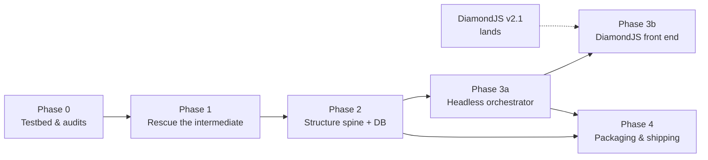

# Ingestion Implementation Plan

**Tracks:** Crystallizer Ingestion & Provenance Specification **`v0.1.0`**
**Status:** Phase 0 partially complete · July 7, 2026

Each phase lists scope, deliverables, acceptance criteria, decision gates, and — because the front end (DiamondJS v2.1) is finishing in parallel — an explicit **front-end dependency** rating. Phases 0 through 3a are buildable with zero DiamondJS knowledge; only 3b binds to it.

---

## Dependency graph

---

## Phase 0 — Testbed & audits

**Front-end dependency: none.** · Est: days · **Status: ~half done**

| Item | Status |
|---|---|
| SurrealDB 3.2.0 installed; §3 schema validated (citation chain, interval overlap, quote integrity, array-ID range scans) | ✅ done 2026-07-07 |
| `onnxruntime-node` under Bun spike: load a DocLayout-YOLO ONNX export, run one page, on this machine | ☐ |
| Docling audit: does its intermediate preserve bboxes + reading order (the sidecar's provenance requirement)? | ☐ |
| Marker audit: same test (carried over from merge plan §8) | ☐ |

**Decision gate closed by this phase:** build-vs-borrow for Morphic-Structure — which is also the final sidecar-language decision (spec §8). Audit memos get appended to the spec; outcome may bump spec MINOR.

**Acceptance:** spike runs green; both audit memos written; build-vs-borrow decided.

---

## Phase 1 — Rescue the intermediate

**Front-end dependency: none.** · Est: 1–2 weeks · Spec contracts exercised: locus record, sidecar JSON emission

Morphic stops throwing away what it already computes (spec §4) and emits the canonical format.

**Scope:**
1. Bring Morphic into the tree as the ingestion module (promote from `_old_morphic_repo/` snapshot; keep git history if practical).
2. Remove the stage-4 `hocr_path.unlink()`; hOCR becomes a first-class intermediate artifact.
3. **hOCR → Markdown emitter**: from `ocr_carea`/`ocr_par`/`ocr_line` — full UTF-8, *never* routed through the PDF text layer (which is ASCII-lossy).
4. **Provenance sidecar emitter**: block-level locus records (offset in codepoint-NFC, linecol, quote anchor, physical page + fractional region), stamped with `spec_version`.
5. **Folio inference v0**: folio candidates from header/footer bbox zones → monotonic run fitting → interpolation; per-page `{folio, sequence, method, confidence}`; unresolved reported, never guessed.
6. **Fidelity score v0**: per-page and per-document roll-up of `x_wconf` distributions + dehyphenation hit rate + Unicode-loss detection.
7. **Offset-unit conformance tests** (the Python side of the cross-language pair; TS side lands in 3a).

**Deliverable:** CLI — `PDF/images in → canonical.md + sidecar.json + fidelity report out` (searchable-PDF output retained as an optional secondary artifact).

**Acceptance:** the 5-page sample (`_old_morphic_repo/ocr_sample_input_files/`) round-trips; every quote anchor verifies against the Markdown at its offsets; zero non-ASCII characters lost; folio inference returns method+confidence per page.

---

## Phase 2 — Structure spine + database

**Front-end dependency: none.** · Est: 2–3 weeks · Spec contracts exercised: full schema, quarantine transitions

**Scope:**
1. ONNX layout model in the sidecar (per Phase-0 audit outcome: DocLayout-YOLO-class model or Docling stack) — region kinds: heading/paragraph/list_item/table/caption/footnote.
2. TATR-class table structure for detected table regions; table-detection certainty recorded.
3. Reconciliation layer: layout regions × Tesseract `ocr_carea`/`ocr_par`/`x_size` → typed block spans with reading order.
4. SurrealDB writer: `documents`/`pages`/`spans`/`chunks`/`ingest_runs` populated per spec §3; content-addressed document IDs; idempotent re-ingest.
5. Chunking + embedding into `chunks` (late-chunking technique per merge plan §8); embedding model recorded via existing `embeddings_models` pattern.
6. **Structural quarantine live**: `ingesting → quarantined | active` transitions; chunks created only on activation.
7. Fidelity v1: layout-model confidence + table certainty + folio confidence folded in.
8. Schema hardening: replace `FLEXIBLE` object fields with explicit subfield definitions (spec → `1.0.0` candidate).
9. Input-type routing: born-digital PDF and Markdown paths (DOCX/EPUB may trail as MINOR additions).

**Decision gates (user sign-off):** §7.2 quarantine default · §7.3 fidelity formula/weights/threshold.

**Acceptance:** a real scanned book ingests end-to-end on laptop CPU; quarantined doc has zero `chunks` rows; interval-overlap provenance resolves for every chunk; fidelity components queryable per page.

---

## Phase 3a — Headless orchestrator

**Front-end dependency: none — deliberately.** · Est: overlaps SurrealDB rebuild

Everything the front end will consume, built and testable via `curl` before DiamondJS binds to it.

**Scope:**
1. Bun orchestrator skeleton (`Bun.serve`); TS side of offset-unit conformance tests.
2. Sidecar process management: spawn, stdio JSON protocol, health, timeout/retry.
3. **Ingest API**: upload endpoint → ingest state machine → SurrealDB.
4. **Progress event protocol** (the contract the completion ring binds to): SSE stream of `{stage: extract|ocr|dehyphenate|structure|folio|score, page, of, status, fidelity?}` — versioned with the spec, designed framework-agnostic.
5. **Quarantine review API**: list, inspect (pages + spans + fidelity components), approve/reject.
6. **Citation write path**: `RELATE crystals->cites->spans` at synthesis time; **citation resolution API**: claim → full locus fan-out (the §3.6 traversal).
7. Escalation hook (Ollama detection + per-page VLM re-process as opt-in API).

**Acceptance:** full ingest driven by `curl` + SSE from terminal; citation chain resolvable over HTTP; quarantine workflow completable without any UI.

---

## Phase 3b — Front end (DiamondJS v2.1)

**Front-end dependency: TOTAL — DiamondJS v2.1 is ready (https://github.com/Node0/diamondjs), unblocked as of 2026-07-07.** App language: **TypeScript** (chosen).

**Scope:** upload/drop surface + side-load toast (air-gapped flow) · completion ring with live stages bound to the SSE protocol · fidelity display (ring + named components, not a bare percentage) · quarantine review screens · citation inspection (claim → quote → page region → folio).

**Coupling questions — resolved by v2.1's design:**
- **Transport:** DiamondJS deliberately has no transport layer — the REST + SSE contract stands unchanged. The front end gets a thin typed API client + `EventSource` consumer as a service module; `Collection<T>` (O(1) append, built for 100K+ items) is the natural sink for span/page streams in quarantine review.
- **SPA vs SSR:** client-side SPA, compiled by Parcel 2 (`parcel-transformer-diamond`). `Bun.serve` serves the built `dist/` statically plus `/api` + `/events` on a single origin (no CORS, EventSource-friendly). Dev loop: `parcel watch` beside `bun --hot`.
- **Auth/session:** none prescribed. v0 posture: bind `127.0.0.1`, no auth, middleware slot reserved for later.

---

## Phase 4 — Packaging & shipping

**Front-end dependency: partial** (installers ship whatever UI exists; can start before 3b completes). · Est: ~2 weeks first pass

**Scope:** PyInstaller one-dir sidecar build in CI · macOS sign + notarize pipeline · Windows Azure Trusted Signing + installer + winget manifest · Linux deb/rpm + published Docker image (dev furniture) · model shipping tiers (spine travels in installer; VLMs fetch-on-demand; manual side-load) · vendored SurrealDB + launcher/updater.

**Acceptance:** clean-machine installs on all three platforms; core ingest works offline on first launch.

---

## Sequencing note

Phases 0–3a are one continuous, front-end-independent workstream (~5–7 weeks of focused work). DiamondJS v2.1 can land any time before 3b without blocking anything — and the 3a event protocol gives it a stable, documented contract to bind to on day one.
