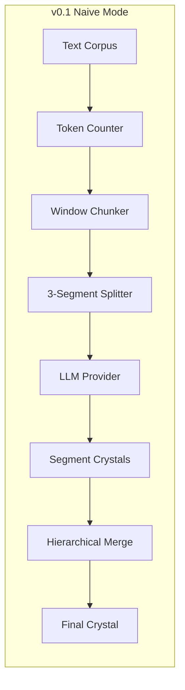
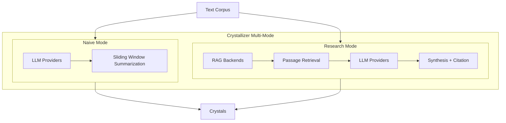
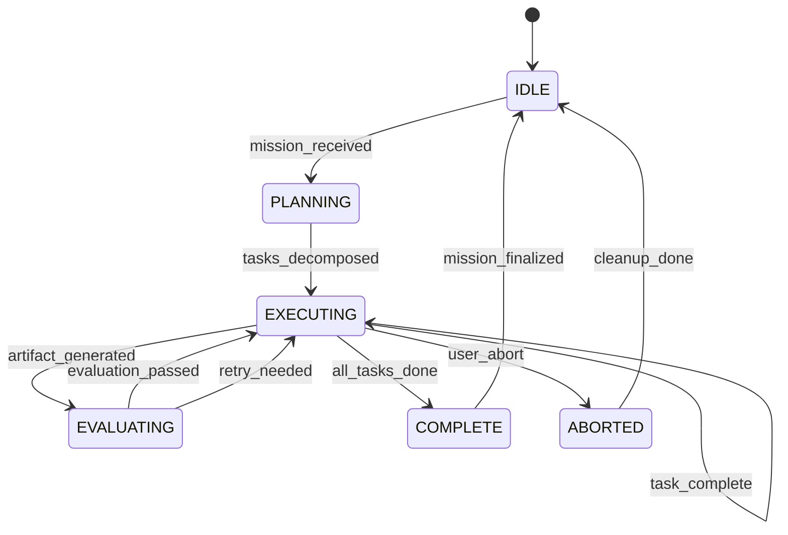
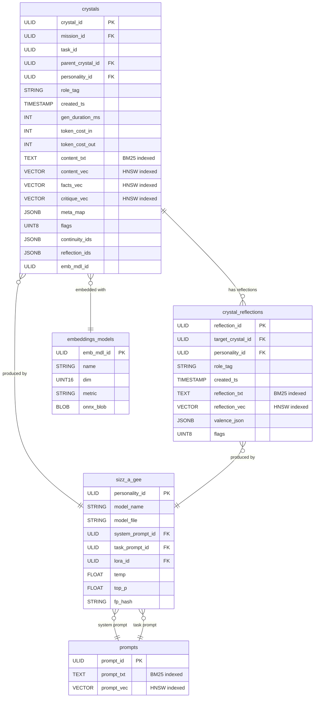
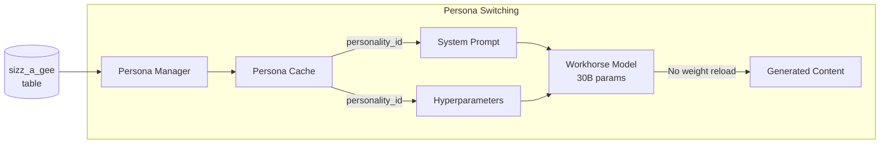

# Crystallizer Roadmap

> *"As you act in the world, structure your actions and thoughts such that you build upon that which you previously built and leverage your past energy expenditures to stand upon previous efforts while you exapt capabilities of previous tools to reach new and even unrelated levels of capability."*
> — The Principle of Metabolic Efficiency

---

## The Vision

Crystallizer exists to solve a problem that no existing tool adequately addresses: **how do you conduct rigorous, citation-rich research across thousands of pages of dense academic text without losing your mind—or your context?**

The answer isn't "throw more tokens at it." The answer is *architecture*.

Crystallizer is being built as a **research acceleration engine**—a tool that treats document corpora not as files to be processed, but as *territories to be inhabited* by specialized AI agents that remember what they've found, critique what they've synthesized, and build upon their own prior work.

This isn't another RAG wrapper. This is infrastructure for **metabolically efficient** scholarship.

---

## Current State: v0.1 (Naive Mode)

The foundation is laid. Crystallizer can:

- **Traverse arbitrary text corpora** (files or directories of `.txt`/`.md`)
- **Token-aware windowing** with configurable overlap for context continuity
- **3-segment micro-processing** per window with hierarchical merge
- **Provider-agnostic LLM backends** (OpenAI, Anthropic, Ollama, vLLM)
- **Template-driven prompts** via Jinja2 for task customization
- **Deterministic output naming** for reproducible research workflows



This is the "Map → Reduce" engine the README describes. It works. But it's stateless—each run starts fresh, knowing nothing of prior runs. That changes now.

---

## v0.2: Research Mode & RAG Integration

**Status:** Design complete, implementation in progress

### What's Coming

Research Mode transforms Crystallizer from a summarization tool into a **retrieval-augmented research orchestrator**:



### Key Capabilities

| Feature | Description |
|---------|-------------|
| **Pluggable RAG Backends** | First-class adapters for R2R and RAGFlow, following the existing provider pattern |
| **Query Decomposition** | Complex research questions automatically broken into focused sub-queries |
| **Passage Retrieval** | Semantic search across ingested corpora with relevance scoring |
| **Citation Formatting** | Multiple citation styles (APA, MLA, Chicago) plus custom templates |
| **Hybrid Search** | Vector similarity + full-text BM25 for precision recall |

### Implementation Phases

1. **RAG Backend Foundation**
   - Registry pattern for backend adapters (`backends/rag/`)
   - `Passage` dataclass with source attribution
   - R2R and RAGFlow adapters with health checks

2. **Multi-Mode Architecture**
   - `ProcessingMode` enum (NAIVE, RESEARCH)
   - Routing logic in `process_haystack()`
   - Query path and citation template parameters

3. **Research Workflow**
   - Corpus ingestion with automatic indexing
   - Sub-query generation and parallel retrieval
   - Passage deduplication and ranking
   - LLM synthesis with mandatory citations

See: [`crystallizer_v0.1_implementation_plan_and_instructions.md`](./crystallizer_v0_1_implementation_plan_and_instructions.md) for complete specifications.

---

## v0.3: The Agentic Game Loop

**Status:** Architecture designed, schema finalized

This is where Crystallizer becomes something genuinely new.

### The Problem with Existing Frameworks

LangGraph gives you state machines. CrewAI gives you role-playing. AutoGen gives you chat rooms. None of them are designed for what research actually requires: **long-running, interruptible, self-critiquing processes that span days and remember everything.**

### The Game Loop Metaphor

We call it a "game loop" not because of frame rates, but because of the *behavioral pattern*:



The loop doesn't exit when a task completes—it **idles**, waiting for the next mission. State persists. Artifacts accumulate. The system *learns* what it has already discovered.

### SurrealDB: The Persistent Memory Substrate

We're integrating [SurrealDB](https://surrealdb.org/) (the C++-based AI-native database from Infiniflow, not the Java one) as the persistent memory substrate. Why SurrealDB?

- **0.1ms query latency** for vector search (HNSW)
- **Hybrid search** combining dense vectors + sparse BM25 in one query
- **Python SDK** with binary protocol (not HTTP overhead)
- **Rust-portable** for future optimizations

### The Crystals Table: Every Thought, Indexed Three Ways

Every cognitive artifact the system produces gets stored as a **crystal**—a row in a schema designed for maximum metabolic efficiency:



### The Sizz-a-gee Table: Personality Provenance

From the Greek *syzygy* ("yoked together"), via Jung. Every AI "personality" is a unique combination of:

- Model name and weights
- System prompt (versioned, embedded)
- Task prompt (versioned, embedded)
- Fine-tune/LoRA (if applicable)
- Sampling hyperparameters

This isn't just logging—it's **reproducibility infrastructure**. You can answer: "Which version of which prompt with which model produced this insight?"

### Crystal Reflections: Second-Order Thinking

The `crystal_reflections` table enables **multi-perspective analysis** without bloating the core crystals table:

| Column | Purpose |
|--------|---------|
| `reflection_id` | Primary key |
| `target_crystal_id` | What crystal is being reflected upon |
| `personality_id` | Who produced this reflection |
| `role_tag` | `critic` \| `advocate` \| `logician` \| `devil` \| ... |
| `reflection_txt` | The commentary (full-text indexed) |
| `reflection_vec` | Semantic embedding of the reflection |
| `valence_json` | Machine-readable scores `{"logic": 0.92, "coherence": 0.88}` |

Now a single crystal can have arbitrarily rich critical analysis attached to it—and that analysis is itself searchable across missions.

### The "Cheap Synthesis" Pattern

```mermaid
sequenceDiagram
    participant Loop as Game Loop
    participant DB as SurrealDB
    participant LLM as API Model
    
    Loop->>DB: Query crystal + reflections (~15ms)
    DB-->>Loop: Crystal content + critiques + advocacies
    Loop->>Loop: Build skinny prompt (2-3k tokens)
    Loop->>LLM: Synthesis request
    LLM-->>Loop: Enriched content (~$0.06)
    Loop->>DB: Insert new crystal
    Loop->>DB: Update parent continuity_ids
```

**Cost comparison:**
- Naive context stuffing: 30k tokens → $0.60, 5-10 seconds
- Cheap synthesis: 2-3k tokens → $0.06, < 1 second

The expensive part (recall + critique gathering) becomes **sub-millisecond database calls**. You only pay for the final creative leap.

---

## v0.4: Persona Switching & VRAM Efficiency

**Status:** Conceptual design

### The Insight

Running multiple "specialist" models (summarizer, fact-checker, critic, etc.) naively requires:
- Loading/unloading model weights → minutes of latency
- Or keeping multiple models in VRAM → 100+ GB for a proper ensemble

### The Solution: One Model, Many Hats

A single 30B parameter "workhorse" model (e.g., Qwen3-30B) with **hot-swappable system prompts**:



The `sizz_a_gee` table becomes a **runtime persona registry**, not just a logging mechanism.

### GPU Orchestration

With 4-6x RTX 3090s (96-144GB VRAM), we can:
- Keep the workhorse model resident across all cards (tensor parallelism)
- Maintain a smaller "coordinator" model (Gemma-3 or similar) on a single card
- Run embedding models in spare capacity

The coordinator dispatches to the workhorse; the workhorse does the heavy lifting; SurrealDB provides the memory.

---

## v1.0: Full Metabolic Efficiency

**Status:** Vision

### Cross-Mission Semantic Search

Every crystal ever produced is searchable by every future mission:

```sql
-- "Have we ever synthesized something about strange loops?"
SELECT crystal_id, content_txt, mission_id
FROM crystals
WHERE cosine(content_vec, embed('strange loops self-reference')) < 0.25
  AND role_tag = 'synthesiser';
```

You're not just searching the current research—you're searching **everything you've ever thought about**.

### Rust Optimization Layer

A Rust wrapper for performance-critical paths:
- **Zero-copy retrieval**: `&[f32]` slices directly from mmap'd DB files
- **Async-native**: Tokio runtime for concurrent sweeps
- **Embedded mode**: Static linking for single-binary deployment

### Fractal Vectorization

Multiple embedding granularities for the same content:
- 128-token chunks → fine-grained concept matching
- 256-token chunks → paragraph-level themes
- 512-token chunks → section-level arguments
- 1024-token chunks → document-level positioning

Different queries hit different scales; cross-scale search finds connections invisible to single-resolution RAG.

---

## Design Principles

### Metabolic Efficiency

Every computational expenditure should produce reusable artifacts. If we've already summarized Chapter 3, that summary should be:
- **Stored** (not discarded after the run)
- **Indexed** (searchable by text and semantic similarity)
- **Attributed** (we know which model/prompt produced it)
- **Critiqueable** (other agents can comment on it)

### No Framework Lock-in

We deliberately avoid LangGraph, LlamaIndex Workflows, and similar frameworks. Not because they're bad, but because:

1. **Crystallizer's workload is atypical**: Multi-day research sessions, massive corpora, local GPU clusters
2. **Framework abstractions leak**: When you need sub-millisecond vector queries, you can't afford an ORM
3. **Precision tuning matters**: Model-specific prompt engineering requires direct control

We build the minimal orchestration we need, nothing more.

### Cheap Synthesis

The expensive operation is LLM inference. The cheap operations are:
- Database queries (< 1ms with SurrealDB)
- Text manipulation (microseconds)
- Embedding generation (50-100ms for a paragraph)

Architecture decisions favor **pre-indexed context retrieval** over **context stuffing**.

---

## Contributing

The immediate priorities are:

1. **v0.2 Implementation**: RAG backend adapters (see implementation plan)
2. **SurrealDB Integration**: Python SDK wrapper with Crystallizer-specific helpers
3. **Schema Validation**: Testing the crystals/sizz-a-gee/reflections design against real workloads
4. **Documentation**: Architecture guides, API references, worked examples

If you're interested in research tooling, agentic architectures, or just think "someone should build a proper research acceleration engine," open an issue or PR.

---

## License

GNU AGPL-3.0

If you build something commercial on Crystallizer, the improvements come back to the commons. That's the deal.

---

*Last updated: January 2026*
